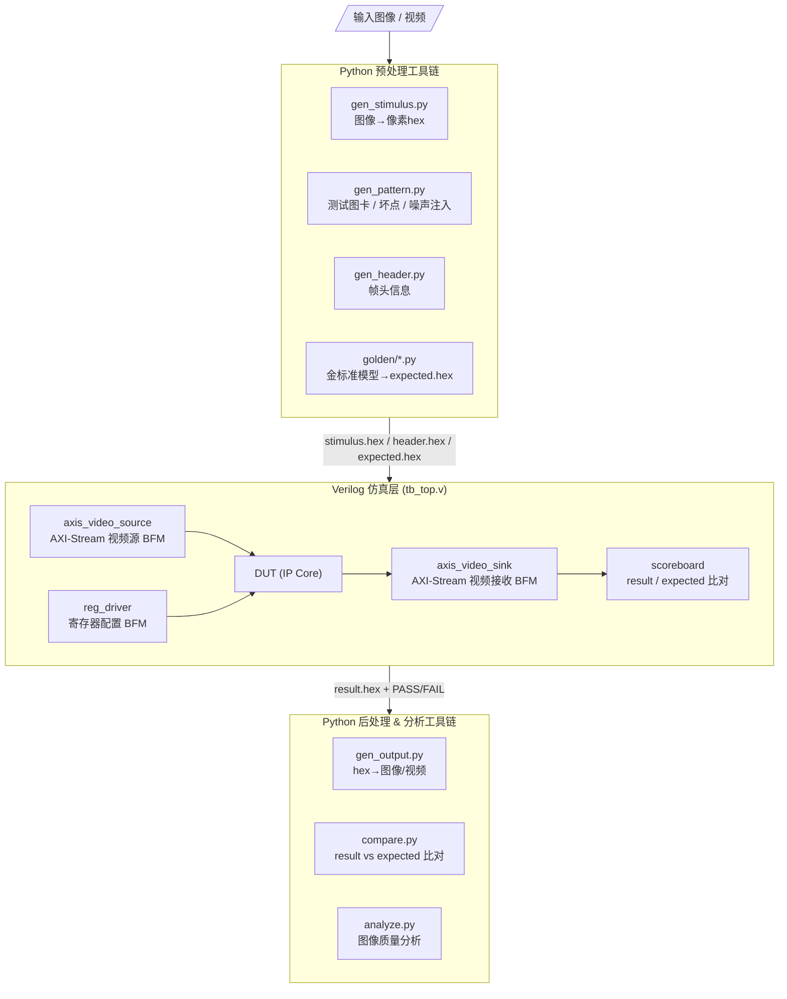
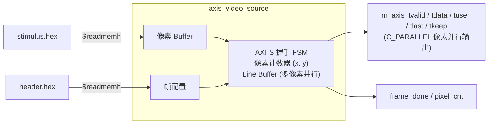
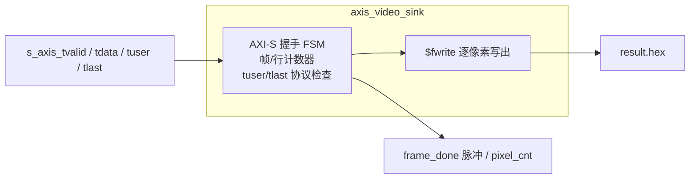

# VIP 仿真验证系统设计说明书

| 属性   | 值              |
| ---- | -------------- |
| 版本   | 1.2.0          |
| 日期   | 2026-06-24     |
| 状态   | 已实现           |
| 课题编号 | AWESOM-SIM-01  |

---

## 一、系统概述

### 1.1 背景与目标

VIP（视频处理IP）开发需要一套完整的仿真验证环境，能够：

- 将**真实图像/视频文件**自动转换为 Verilog 仿真激励
- 生成**标准测试图卡**（灰阶/色卡/斜边图等）并支持坏点、噪声注入
- 将仿真输出数据**还原为图像/视频**，便于直观验证
- 提供 **Python 金标准模型（Golden Model）**，按位精确比对仿真输出，自动判定 PASS/FAIL
- 提供**图像质量分析工具**，量化评估 IP 处理效果（锐度、白平衡、PSNR 等）

本系统采用 **Python + Verilog** 双层架构，Python 负责文件 I/O 与图像分析，Verilog 负责仿真时序驱动。

### 1.2 整体数据流



### 1.3 技术选型

| 组件       | 工具/语言               | 说明          |
| -------- | ------------------- | ----------- |
| 图像预处理    | Python 3 + Pillow/OpenCV | 读写图像、颜色空间转换 |
| 视频预处理    | Python 3 + OpenCV         | 逐帧提取/合成     |
| 仿真引擎     | Icarus Verilog (iverilog)  | 开源、轻量、`-g2012` 支持；Verilator 列入后续扩展 |
| 波形查看     | VaporView (IDE 内) / GTKWave | 时序调试        |
| 图像分析     | Python + NumPy + OpenCV | PSNR/直方图/锐度 |
| 构建系统     | Makefile            | 纯 Python 编排 (scripts/sim.py)，跨平台兼容 (Windows/macOS/Linux)；Makefile 为薄封装供 Mac/Linux 用户使用 |
| IDE 封装    | Trae / VS Code 扩展 (.vsix) | "VIP Sim" 扩展 — 控制台 GUI、分析面板、项目脚手架 |

**iverilog 性能约定**：iverilog 为解释执行，速度有限。一帧 4K 含 830 万像素，全分辨率仿真可能耗时数十分钟。因此约定：

- **日常调试 / 回归测试**：使用缩小分辨率（如 256×144 或 64×64），算法逻辑与全分辨率完全一致，gen_stimulus.py 的 `--width/--height` 直接支持缩放
- **里程碑验证**：仅在 IP 功能稳定后跑 1~2 次全分辨率（1080p / 4K）确认行缓冲、计数器位宽等与分辨率相关的逻辑
- **波形 dump**：默认关闭，调试时通过 `make sim WAVE=1` 开启（`$dumpvars` 受 plusargs 控制），避免 VCD 文件过大拖慢仿真

### 1.4 跨平台支持

本系统支持 **Windows、macOS 和 Linux** 三大平台。v1.0.1 起增加了完整的 Windows 兼容性：

| 平台 | 仿真器安装 | Python | 构建系统 |
| --- | --- | --- | --- |
| macOS | `brew install icarus-verilog` | 系统自带或 `brew install python@3.10` | `make` 或 `python scripts/sim.py` |
| Linux | `sudo apt install iverilog` | 系统自带 | `make` 或 `python scripts/sim.py` |
| Windows | `scoop install icarus-verilog` | `python.org` 下载安装 | `python scripts/sim.py`（无需 make） |

**Windows 兼容措施**：
- 构建编排除依赖 GNU Make / Unix shell，改用纯 Python 实现的 `scripts/sim.py`
- Python 虚拟环境路径自适应（Windows: `.venv\Scripts\`，Mac/Linux: `.venv/bin/`）
- 扩展执行子进程时自动设置 `PYTHONIOENCODING=utf-8`，确保中文输出正确
- 控制台图标在 Windows 上使用 ASCII 替代 Unicode 字符（避免 GBK 编码错误）

---

## 二、目录结构

```
video_sim/
├── docs/
│   └── DESIGN_SPEC.md              # 本设计说明书
├── rtl/                            # DUT 源代码（各IP的RTL）
│   └── <ip_name>/
│       ├── <ip_name>.v
│       ├── <ip_name>_core.v
│       └── ...
├── sim/
│   ├── common/                     # 公共仿真BFM库
│   │   ├── axis_video_source.v     # AXI-S 视频源 BFM
│   │   ├── axis_video_sink.v       # AXI-S 视频接收 BFM
│   │   ├── reg_driver.v            # 寄存器配置 BFM
│   │   ├── axis_protocol_checker.v # AXI-S 协议检查器
│   │   └── sim_utils.vh            # 公共宏/函数
│   ├── tests/                      # 各IP的 Testbench
│   │   ├── tb_color_space_conv.v
│   │   ├── tb_gamma_corr.v
│   │   ├── tb_denoise.v
│   │   └── ...
│   └── testdata/                   # 仿真数据文件
│       ├── stimulus.hex            # 像素激励数据
│       ├── header.hex              # 帧头信息
│       └── expected.hex            # 期望输出（可选）
├── scripts/                        # Python 工具集
│   ├── console.py                  # 终端美化模块（banner/table/progress/spinner）
│   ├── gen_stimulus.py             # 图像→激励hex
│   ├── gen_pattern.py              # 测试图卡生成/坏点/噪声注入
│   ├── gen_header.py               # 帧头信息生成
│   ├── gen_output.py               # 结果hex→图像/视频
│   ├── gen_video_stimulus.py       # 视频→逐帧激励
│   ├── gen_video_output.py         # 多帧hex→视频合成
│   ├── compare.py                  # result.hex vs expected.hex 逐字比对
│   ├── golden.py                   # 各IP金标准参考模型（按位定点复现）
│   ├── verify.py                   # 仿真验证编排器（金标准比对入口）
│   ├── analyze.py                  # 图像质量分析器（命令行入口）
│   ├── analyzers/
│   │   ├── __init__.py
│   │   ├── sharpness.py            # 锐度分析（Laplacian/Sobel/Tenengrad）
│   │   ├── white_balance.py        # 白平衡分析（灰度世界增益/色温估算）
│   │   ├── histogram.py            # RGB 三通道直方图统计
│   │   ├── psnr.py                 # PSNR 逐通道计算
│   │   └── gamma.py                # Gamma 曲线实测拟合
│   └── utils/
│       ├── __init__.py
│       ├── pixel_format.py         # 像素格式打包/解包工具
│       └── hex_io.py               # hex 文件读写工具
├── output/                         # 输出目录
│   ├── images/                     # 输出图像
│   ├── reports/                    # 分析报告
│   └── waves/                      # 波形文件
├── Makefile                        # 顶层构建脚本
└── README.md                       # 快速入门
```

---

## 三、Python 工具链详细设计

### 3.1 像素格式定义

| 格式 ID | 名称     | 每像素位宽 | AXI tdata 宽度 | Python dtype | 说明              |
| ------ | ------ | ------ | ------------ | ------------ | --------------- |
| 0      | RAW8   | 8      | 32 (低8位)     | uint8        | 原始Bayer数据       |
| 1      | RAW10  | 10     | 32 (低10位)    | uint16       | 10bit原始数据       |
| 2      | RAW12  | 12     | 32 (低12位)    | uint16       | 12bit原始数据       |
| 3      | RGB888 | 24     | 32 (低24位)    | uint8×3      | 标准彩色            |
| 4      | YUV422 | 16     | 32 (低16位)    | uint8×2      | 每像素2 bytes     |
| 5      | YUV444 | 24     | 32 (低24位)    | uint8×3      | 完整色度            |

### 3.2 gen_stimulus.py — 图像转激励

**功能**：将输入图像文件转换为仿真可用的 hex 文本文件。

```
输入: input.png/bmp/jpg, --format RGB888, --width 1920, --height 1080
输出: stimulus.hex (每行一个32bit hex字，逐像素、逐行排列)
```

**处理流程**：

```
1. 读取图像，resize 到目标分辨率
2. 根据目标格式做颜色空间转换
   - RGB→YUV: OpenCV cvtColor
   - 彩色→RAW: Bayer CFA 模拟（可选）
3. 逐像素 pack 为 32bit hex 字
4. 写入 stimulus.hex
```

**命令行接口**：

```bash
python scripts/gen_stimulus.py \
    --input  input.png \
    --output sim/testdata/stimulus.hex \
    --format RGB888 \
    --width  1920 \
    --height 1080 \
    --fps 30                          # 多帧时使用
```

**输出文件格式** (stimulus.hex):

```
// stimulus.hex 示例 (RGB888, 1920x1080)
// 格式: 每行一个32bit十六进制值, {8'd0, R[7:0], G[7:0], B[7:0]}
// 共 1920*1080 = 2,073,600 行
00FFA500
0000FF00
00FF0000
...
```

### 3.3 gen_header.py — 帧头信息生成

**功能**：生成帧的元数据文件，供 Verilog Source BFM 读取。

```
输入: --width 1920, --height 1080, --format 3, --frames 1
输出: header.hex
```

**输出文件格式** (header.hex):

```
// header.hex - 帧描述信息
@0000  00000780   // [31:16] 图像宽度, [15:0] 图像高度
@0001  00000003   // [7:0] 像素格式ID
@0002  00000001   // 总帧数
@0003  0000001E   // 帧率 (30fps)
```

### 3.4 gen_output.py — 结果还原为图像

**功能**：将仿真输出 hex 文件还原为可查看的图像或视频。

```bash
python scripts/gen_output.py \
    --input  sim/testdata/result.hex \
    --output output/images/result.png \
    --format RGB888 \
    --width  1920 \
    --height 1080
```

**处理流程**：

```
1. 读取 result.hex，逐行解析 32bit hex 值
2. 根据格式从 tdata 中提取像素值
3. 重塑为 H×W×C 的 NumPy 数组
4. 保存为图像文件（PNG/BMP）
```

多帧时支持输出为视频：

```bash
python scripts/gen_output.py \
    --input  result.hex \
    --output output/video/result.mp4 \
    --format RGB888 \
    --width 1920 --height 1080 \
    --fps 30 --frames 300
```

### 3.5 analyze.py — 图像质量分析工具

**功能**：对比输入/输出图像，输出量化质量指标。

```bash
# 完整分析
python scripts/analyze.py \
    --input  input.png \
    --output output.png \
    --report output/reports/analysis.json

# 单项分析
python scripts/analyze.py --input img.png --metric sharpness
python scripts/analyze.py --input img.png --metric white_balance
python scripts/analyze.py --input img.png --metric histogram
```

#### 3.5.1 锐度分析 (sharpness.py)

| 指标             | 算法                  | 说明       |
| -------------- | ------------------- | -------- |
| Laplacian 方差   | `cv2.Laplacian().var()` | 整体锐度     |
| Sobel 梯度均值     | `cv2.Sobel()` 梯度幅值  | 边缘强度     |
| Tenengrad 值    | Sobel 平方和            | 经典对焦评价   |
| MTF (调制传递函数)  | 斜边法                 | 频率响应，更专业 |

输出示例：

```json
{
  "sharpness": {
    "laplacian_variance": 1245.3,
    "sobel_mean": 45.2,
    "tenengrad": 3.8e6,
    "grade": "良好"
  }
}
```

#### 3.5.2 白平衡分析 (white_balance.py)

| 指标         | 算法                      | 说明           |
| ---------- | ----------------------- | ------------ |
| 平均色温       | 灰度世界假设计算 R/G/B 增益        | 偏色的定量评估      |
| 白点检测       | 检测图像中最亮的区域的色偏           | 白色还原度        |
| 灰卡区域分析     | 指定 ROI 内 R/G/B 均值        | 需要标准灰卡图像     |

输出示例：

```json
{
  "white_balance": {
    "r_gain": 1.05,
    "g_gain": 1.00,
    "b_gain": 0.92,
    "color_temp_estimate": 5800,
    "bias": "偏暖"
  }
}
```

#### 3.5.3 PSNR 分析 (psnr.py)

```json
{
  "psnr": {
    "overall": 42.3,
    "channel_r": 41.8,
    "channel_g": 42.5,
    "channel_b": 42.7
  }
}
```

#### 3.5.4 Gamma 分析 (gamma.py)

通过采集不同灰度级的输入输出值，绘制实际的 Gamma 曲线并与目标曲线对比。

#### 3.5.5 色准分析 (color_checker.py)

支持 X-Rite ColorChecker 24色卡识别，计算 ΔE 色差值。

#### 3.5.6 报告生成 (report.py)

汇总所有分析指标，生成 JSON 或 Markdown 格式的综合报告：

```json
{
  "input_file": "input.png",
  "output_file": "output.png",
  "resolution": "1920x1080",
  "format": "RGB888",
  "timestamp": "2026-06-12 10:30:00",
  "metrics": {
    "sharpness": { ... },
    "white_balance": { ... },
    "psnr": { ... },
    "gamma": { ... }
  },
  "summary": "图像质量：良好。锐度无明显损失，白平衡偏暖约5%。"
}
```

### 3.6 gen_pattern.py — 测试图卡生成与故障注入

真实照片无法覆盖所有 IP 的验证需求（AWB 需要已知色温的灰卡、DPC 需要已知位置的坏点、降噪需要已知强度的噪声），因此提供合成图卡生成器：

| 图卡类型           | 参数                     | 适用 IP        |
| -------------- | ---------------------- | ------------ |
| 灰阶渐变 (ramp)    | 方向、级数                  | Gamma、对比度增强  |
| 彩条 (colorbar)  | SMPTE / 全饱和            | 色彩空间转换       |
| 纯色/灰卡          | RGB 值、模拟色温偏移           | 自动白平衡        |
| 斜边图 (slanted edge) | 角度（默认5°）           | 锐化（MTF 测量）   |
| ColorChecker 24色卡 | 标准 sRGB 值            | 色彩空间转换、AWB   |
| 棋盘格            | 格子尺寸                   | 边界/几何检查      |

**故障注入选项**（可叠加在任意图卡或真实图像上）：

```bash
# 注入高斯噪声 (sigma=10) — 用于降噪IP测试
python scripts/gen_pattern.py --base input.png --inject gaussian --sigma 10 -o noisy.png

# 注入椒盐噪声/坏点（同时输出坏点坐标表 dpc_table.txt）— 用于DPC IP测试
python scripts/gen_pattern.py --base input.png --inject dead_pixel --count 100 \
    -o defect.png --table sim/testdata/dpc_table.txt

# 模拟偏色（色温3000K白炽灯）— 用于AWB IP测试
python scripts/gen_pattern.py --base graycard.png --color-temp 3000 -o warm.png
```

### 3.7 金标准模型与自动比对

每个 IP 在 `scripts/golden/` 下有一个 Python 参考模型，**按位精确**（bit-accurate）复现 RTL 算法：与 RTL 使用相同的定点量化、相同的舍入/饱和规则，而非浮点近似。这是自动回归判定 PASS/FAIL 的依据。

```bash
# 生成期望输出
python scripts/golden/gamma.py \
    --input sim/testdata/stimulus.hex \
    --gamma 2.2 \
    --output sim/testdata/expected.hex

# 仿真后比对（逐字比较，输出首个不匹配位置及差异统计）
python scripts/compare.py \
    --result   sim/testdata/result.hex \
    --expected sim/testdata/expected.hex \
    --tolerance 0          # RAW/查表类IP容差为0；含乘法截断的IP可放宽至±1 LSB
```

**比对策略**：

| IP 类型               | 容差        | 说明                  |
| ------------------- | --------- | ------------------- |
| Gamma、DPC（查表/选择类）   | 0 LSB     | 结果必须完全一致            |
| CSC、AWB、降噪、锐化（乘加类）  | ≤1 LSB    | 允许定点舍入差异，须在模型中说明     |
| 对比度增强（统计类）          | ≤1 LSB    | 直方图统计须逐bin一致         |

`compare.py` 返回非零退出码表示 FAIL，供 Makefile / CI 直接使用。

---

## 四、Verilog 仿真 BFM 详细设计

### 4.1 axis_video_source.v — AXI-Stream 视频源



**模块接口**：

```verilog
module axis_video_source #(
    parameter C_DATA_WIDTH  = 32,
    parameter C_MAX_WIDTH   = 3840,
    parameter C_MAX_HEIGHT  = 2160,
    parameter C_PARALLEL    = 4,       // 并行度
    parameter C_STIMULUS_FILE = "stimulus.hex",
    parameter C_HEADER_FILE   = "header.hex"
) (
    input  wire        aclk,
    input  wire        aresetn,
    // AXI-Stream 输出
    output wire        m_axis_tvalid,
    input  wire        m_axis_tready,
    output wire [C_DATA_WIDTH*C_PARALLEL-1:0] m_axis_tdata,
    output wire [C_PARALLEL-1:0]              m_axis_tuser,
    output wire [C_PARALLEL-1:0]              m_axis_tlast,
    output wire [(C_DATA_WIDTH/8)*C_PARALLEL-1:0] m_axis_tkeep,
    // 状态输出
    output wire        frame_done,
    output wire [31:0] pixel_cnt
);
```

**关键行为**：

| 信号        | 行为                                       |
| --------- | ---------------------------------------- |
| tvalid    | 复位释放后拉高，连续输出（支持 ready/valid 握手反压）         |
| tdata     | 4像素并行输出，{pixel3, pixel2, pixel1, pixel0} |
| tuser     | 每帧第一拍的对应位为1（SOF），bit[0] 对应 pixel0        |
| tlast     | 每行最后一拍的对应位为1（EOL）                        |
| tkeep     | 全1（所有字节有效）                               |
| frame_done | 最后一帧发送完成后拉高一个周期                          |

> **接口宽度说明**：课题规范 2.5 节的 IP 基本结构为单像素接口（tuser/tlast 为 1bit）。BFM 通过 `C_PARALLEL` 参数兼容两种形态：`C_PARALLEL=1` 时各信号退化为 1bit，与基本结构直接对接；`C_PARALLEL=4` 时对应 4 像素并行规格。各 IP 的 Testbench 按 DUT 实际接口选择参数。
>
> 可选 `C_GAP_MODE` 参数控制 tvalid 间隙（连续 / 随机间断），用于验证 DUT 对非连续输入流的处理。

### 4.2 axis_video_sink.v — AXI-Stream 视频接收



```verilog
module axis_video_sink #(
    parameter C_DATA_WIDTH  = 32,
    parameter C_MAX_WIDTH   = 3840,
    parameter C_MAX_HEIGHT  = 2160,
    parameter C_PARALLEL    = 4,
    parameter C_RESULT_FILE = "result.hex"
) (
    input  wire        aclk,
    input  wire        aresetn,
    // AXI-Stream 输入
    input  wire        s_axis_tvalid,
    output wire        s_axis_tready,
    input  wire [C_DATA_WIDTH*C_PARALLEL-1:0] s_axis_tdata,
    input  wire [C_PARALLEL-1:0]              s_axis_tuser,
    input  wire [C_PARALLEL-1:0]              s_axis_tlast,
    // 状态输出
    output wire        frame_done,
    output wire [31:0] pixel_cnt
);
```

**关键行为**：

- `s_axis_tready` 由 `C_READY_MODE` 参数控制：
  - `0` = 始终为 1（无反压，基本功能测试）
  - `1` = 随机反压（按 `C_READY_RATE`% 概率拉高，验证 DUT 握手正确性——课题规范要求 IP 支持 ready/valid 反压）
- 每收到一个有效像素，立即 `$fwrite` 写入 result.hex
- 同时维护帧/行计数器，做协议正确性检查
- 帧结束时输出 `frame_done` 脉冲

### 4.3 reg_driver.v — 寄存器配置 BFM

```verilog
module reg_driver #(
    parameter C_NUM_REGS = 64
) (
    input  wire        aclk,
    input  wire        aresetn,
    // 寄存器接口（连接到 DUT）
    output reg  [7:0]  cfg_addr,
    output reg  [31:0] cfg_wdata,
    output reg         cfg_wen,
    output reg         cfg_ren,
    input  wire [31:0] cfg_rdata,
    // 控制接口
    input  wire        start,
    output wire        done
);
```

**Task API**：

```verilog
// 在 initial 块中调用
reg_driver #(...) u_reg (.aclk(aclk), ...);

initial begin
    wait(aresetn);
    u_reg.write(8'h04, 32'h0000_0001);  // 写 IP_CTRL: 使能模块
    u_reg.write(8'h10, 32'd1920);       // 写 IMG_WIDTH
    u_reg.write(8'h14, 32'd1080);       // 写 IMG_HEIGHT
    u_reg.write(8'h18, 32'd3);          // 写 IMG_FORMAT: RGB888
    u_reg.write(8'h04, 32'h0000_0001);  // 启动
end
```

### 4.4 axis_protocol_checker.v — 协议检查器

实时监测 AXI-Stream 协议违规：

| 检查项          | 说明         |
| ------------ | ---------- |
| tuser 时序检查   | SOF 只在帧首有效 |
| tlast 时序检查   | EOL 每行出现一次 |
| tvalid 间断检查  | 不可长时间无效    |
| 帧大小一致性       | 每行像素数一致    |

---

## 五、文件格式规范

### 5.1 stimulus.hex（激励数据）

```
// 每行一个 32bit 十六进制字（无 0x 前缀，无空格）
// 像素排布: 逐行，行内从左到右
// 对于 C_PARALLEL=4，Verilog 侧每次读取 4 个连续字
// 总行数 = WIDTH × HEIGHT

00FFA500
0000FF00
...
```

### 5.2 result.hex（结果数据）

格式与 stimulus.hex 完全一致，由 axis_video_sink 的 `$fwrite` 写入。

### 5.3 header.hex（帧头信息）

```
// 每条记录: @<addr>  <data>
// addr 和 data 均为 32bit hex

@0000  00000780   // 图像宽度 (31:16) | 图像高度 (15:0)
@0001  00000003   // 像素格式ID (7:0)
@0002  00000001   // 总帧数
@0003  0000001E   // 帧率 (15:0)
@0004  00000001   // C_PARALLEL (并行度)
```

### 5.4 expected.hex（期望输出）

由 `scripts/golden/` 下对应 IP 的金标准模型生成，格式与 result.hex 一致，仿真后由 `compare.py`（或 TB 内 Scoreboard）做自动比对。

---

## 六、各 IP 验证策略

针对课题规范中的 7 个 IP，激励、金标准模型与分析指标的对应关系如下：

| IP        | 推荐激励                      | 金标准模型           | 关键分析指标                       | 判定方式             |
| --------- | ------------------------- | --------------- | ---------------------------- | ---------------- |
| 1 色彩空间转换  | 彩条 + ColorChecker + 真实图像   | golden/csc.py   | PSNR、ΔE 色差                   | 比对 ≤1 LSB        |
| 2 Gamma校正 | 灰阶渐变 + 真实图像               | golden/gamma.py | Gamma 曲线拟合（实测 vs 目标曲线）       | 比对 0 LSB（查表）     |
| 3 自动白平衡   | 偏色灰卡（3000K/6500K）+ 真实图像   | golden/awb.py   | R/G/B 增益、白点色偏、色温估计           | 比对 ≤1 LSB + 增益收敛 |
| 4 坏点校正    | 坏点注入图（坐标表已知）              | golden/dpc.py   | 坏点位置 PSNR、非坏点区域应零差异          | 比对 0 LSB         |
| 5 降噪      | 高斯/椒盐噪声注入图                | golden/denoise.py | 去噪前后 PSNR 提升、噪声标准差、锐度损失      | 比对 ≤1 LSB        |
| 6 锐化      | 斜边图 + 真实图像                | golden/sharpen.py | Laplacian 方差、Tenengrad、MTF50 | 比对 ≤1 LSB        |
| 7 对比度增强   | 低对比度图 + 灰阶渐变              | golden/contrast.py | 直方图分布、动态范围、对比度提升比            | 比对 ≤1 LSB        |

**两层判定**：

1. **功能正确性**（必过）：result.hex vs expected.hex 按容差比对，这是回归测试的 PASS/FAIL 依据
2. **效果量化**（报告项）：analyze.py 输出质量指标，评估算法效果好坏（如降噪后 PSNR 提升多少、锐化后 MTF50 变化），写入分析报告

每个 IP 还须通过公共测试项：随机反压测试、tvalid 间断测试、连续多帧测试、最小（如 64×64）/最大（3840×2160）分辨率测试、复位恢复测试。

---

## 七、典型使用流程

### 7.1 单步调试流程

```bash
# Step 1: 准备测试图像
cp ~/Pictures/test_4k.png sim/testdata/

# Step 2: 生成激励文件
python scripts/gen_stimulus.py \
    -i sim/testdata/test_4k.png \
    -o sim/testdata/stimulus.hex \
    -f RGB888

# Step 3: 生成帧头信息
python scripts/gen_header.py \
    -o sim/testdata/header.hex \
    -w 3840 -h 2160 -f RGB888 -n 1

# Step 4: 生成期望输出（金标准模型）
python scripts/golden/gamma.py \
    -i sim/testdata/stimulus.hex --gamma 2.2 \
    -o sim/testdata/expected.hex

# Step 5: 运行仿真
make sim IP=gamma_corr

# Step 6: 自动比对（PASS/FAIL）
python scripts/compare.py \
    --result sim/testdata/result.hex \
    --expected sim/testdata/expected.hex

# Step 7: 还原输出图像
python scripts/gen_output.py \
    -i sim/testdata/result.hex \
    -o output/images/result.png \
    -f RGB888 -w 3840 -h 2160

# Step 8: 图像质量分析
python scripts/analyze.py \
    --input  sim/testdata/test_4k.png \
    --output output/images/result.png \
    --all \
    --report output/reports/gamma_4k.json

# Step 9: 查看波形（可选）
gtkwave output/waves/gamma_corr.vcd
```

### 7.2 视频处理流程

```bash
# 将视频拆帧并生成激励
python scripts/gen_video_stimulus.py \
    -i input.mp4 \
    -o sim/testdata/ \
    -f RGB888 -w 1920 -h 1080

# 运行仿真（多帧连续处理）
make sim IP=denoise FRAMES=300

# 合成输出视频
python scripts/gen_output.py \
    -i sim/testdata/result.hex \
    -o output/video/result.mp4 \
    -f RGB888 -w 1920 -h 1080 \
    --fps 30 --frames 300
```

### 7.3 自动化回归测试

```bash
make test_all  # 对所有 IP 运行全部测试用例
make test IP=gamma_corr  # 对指定 IP 运行测试
```

每个 IP 的测试配置在 `sim/tests/tb_<ip_name>.v` 中，通过 `$value$plusargs` 获取参数。

---

## 八、Makefile 顶层设计

```makefile
# 仿真工具：Icarus Verilog (iverilog/vvp)

# IP 选择
IP ?= gamma_corr

# 分辨率
WIDTH  ?= 1920
HEIGHT ?= 1080
FORMAT ?= RGB888

# 输入图像
INPUT_IMG ?= sim/testdata/test_$(WIDTH)x$(HEIGHT).png

# 路径
RTL_DIR    = rtl/$(IP)
SIM_DIR    = sim
COMMON_DIR = $(SIM_DIR)/common
OUT_DIR    = output

# === 目标 ===

gen_stimulus: $(INPUT_IMG)
	python scripts/gen_stimulus.py -i $< -o $(SIM_DIR)/testdata/stimulus.hex -f $(FORMAT) -w $(WIDTH) -h $(HEIGHT)
	python scripts/gen_header.py -o $(SIM_DIR)/testdata/header.hex -w $(WIDTH) -h $(HEIGHT) -f $(FORMAT) -n 1

gen_expected: gen_stimulus
	python scripts/golden/$(IP).py -i $(SIM_DIR)/testdata/stimulus.hex -o $(SIM_DIR)/testdata/expected.hex

sim: gen_stimulus
	iverilog -g2012 -o $(OUT_DIR)/$(IP).vvp \
	    $(COMMON_DIR)/*.v $(RTL_DIR)/*.v $(SIM_DIR)/tests/tb_$(IP).v
	vvp $(OUT_DIR)/$(IP).vvp

compare: gen_expected
	python scripts/compare.py \
	    --result $(SIM_DIR)/testdata/result.hex \
	    --expected $(SIM_DIR)/testdata/expected.hex

view_wave:
	gtkwave $(OUT_DIR)/waves/$(IP).vcd &

gen_output:
	python scripts/gen_output.py \
	    -i $(SIM_DIR)/testdata/result.hex \
	    -o $(OUT_DIR)/images/$(IP)_output.png \
	    -f $(FORMAT) -w $(WIDTH) -h $(HEIGHT)

analyze:
	python scripts/analyze.py \
	    --input $(INPUT_IMG) \
	    --output $(OUT_DIR)/images/$(IP)_output.png \
	    --all \
	    --report $(OUT_DIR)/reports/$(IP)_report.json

all: sim compare gen_output analyze

clean:
	rm -rf $(OUT_DIR)/* $(SIM_DIR)/testdata/stimulus.hex $(SIM_DIR)/testdata/result.hex
```

---

## 九、代码生成器（Spec 驱动）

### 9.1 设计理念

**Spec 驱动开发** = 从同一份算法规格文件 `.ip_spec.yaml` **同时生成** RTL、金标准、regdef、TB。RTL 和金标准天然逐位一致，无需人工对照。

```
.ip_spec.yaml (算法描述)
        │
        └─────── gen_ip_spec.py ─────────────┐
                  (Python, 标准库实现)          │
                                             ↓
         ┌──────────────┬─────────────┬────────┴────────┐
         │ RTL (.v)     │ golden.py   │ regdef.json    │ TB (.v)
         │ Verilog      │ 按位比对模型 │ 控制台寄存器表单│ 仿真骨架
         └──────────────┴─────────────┴────────────────┘
```

### 9.2 .ip_spec.yaml 格式

见 `.trae/rules/project_rules.md` §A.1 完整格式定义。核心结构：

```yaml
name: <ip_name>           # 小写下划线
algorithm:
  type: conv_1d           # passthrough / gain / lut / conv_1d / csc / sharpen / denoise
  kernel: [1, -2, 1]     # 整数系数
  fixed_point:
    shift: 3              # 算术右移位数
registers:
  - addr: "0x04"
    default: "0x00000001"
pipeline:
  latency: 1
```

### 9.3 gen_ip_spec.py 命令行接口

| 命令 | 说明 |
|---|---|
| `--spec <file>` | 从 YAML 文件生成 |
| `--chain a,b,c` | 生成级联组合 IP（RTL + regdef）|
| `--register-chain <name>` | 注册级联组合到 golden.py（金标准自动对接）|
| `--dry-run` | 仅预览，不写文件 |

### 9.4 生成物覆盖

| 产出 | 内容 | 需人工修正 |
|---|---|---|
| `rtl/<ip>/<ip>.v` | Verilog RTL（AXI-Stream 接口 + 数据通路）| 数据通路算法 |
| `rtl/<ip>/regdef.json` | 寄存器描述 | 否（若 YAML 正确）|
| `sim/tests/tb_<ip>.v` | Testbench 骨架 | DUT 例化处 |
| `scripts/golden.py` | 金标准函数（追加到 MODELS/CONFIG）| 是（RTL 定点细节）|

### 9.5 级联组合生成

多 IP 直连时（如 AWB→Gamma→锐化），只需一条命令：

```bash
python scripts/gen_ip_spec.py \
    --chain awb,gamma,sharpen \
    --register-chain awb_gamma_sharpen
```

自动产出：

- `rtl/awb_gamma_sharpen/awb_gamma_sharpen.v` — 三个 IP 级联直连
- `rtl/awb_gamma_sharpen/regdef.json` — 合并子 IP 寄存器表（按 0x40 分段）
- `scripts/golden.py` — `m_awb_gamma_sharpen = m_awb ∘ m_gamma ∘ m_sharpen`

---

## 十、后续扩展计划

| 阶段 | 内容                         | 状态 |
| ---- | ---------------------------- | ---- |
| 1    | 完成 Python 工具链 + BFM 库 | ✅ 已完成 |
| 2    | 对接课题一（色彩空间转换IP）完整仿真 | ✅ 已完成 |
| 3    | 对接全部 7 个 IP 的仿真测试      | ✅ 已完成 |
| 4    | 金标准模型按位比对（scripts/golden.py + compare.py） | ✅ 已完成 |
| 5    | DDR 帧缓冲基础设施（行为级 DDR4 AXI4 + 帧缓冲封装） | ✅ 已完成 |
| 6    | **Spec 驱动代码生成器（RTL + golden + TB + regdef 同时生成）** | ✅ 已完成 |
| 7    | 支持 Verilator C++ 联合仿真（更高性能） | 待做 |
| 8    | CI/CD 自动化回归测试流水线         | 待做 |

**阶段 5 — DDR 帧缓冲**：`sim/common/ddr_model.v`（标准 AXI4 内存映射从接口，
参数化位宽/容量/读写延迟）+ `sim/common/axi_frame_buffer.v`（AXI4 主封装，双槽
ping-pong，对外呈现"写帧流/读上一帧流"）。供时域降噪、帧平均等需整帧缓冲的帧间
IP 使用。回环自检 tb_ddr_loopback 通过（读回上一帧 0 错误）。详见
`docs/IP_SPEC_ddr_frame_buffer.md`。

---

**文档版本**：V1.2.0  
**最后更新**：2026-06-24  
