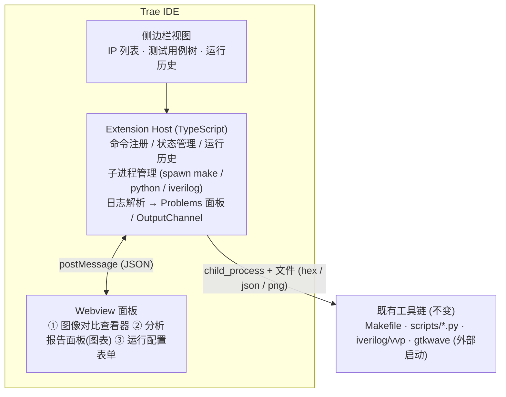
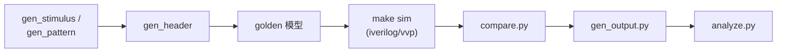
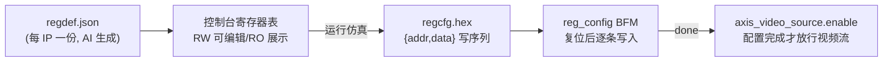
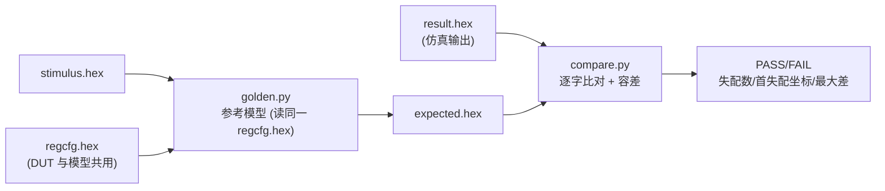
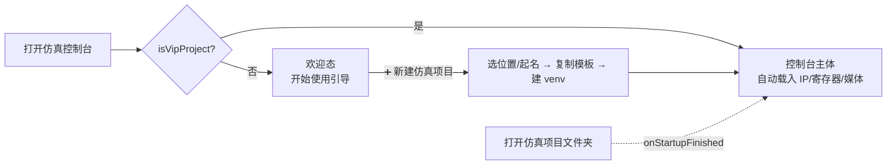

# VIP 仿真环境 Trae 扩展设计说明书

| 属性   | 值              |
| ---- | -------------- |
| 版本   | 1.1.0          |
| 日期   | 2026-06-14     |
| 状态   | 已实现           |
| 课题编号 | AWESOM-SIM-02  |
| 关联文档 | DESIGN_SPEC.md（仿真系统设计说明书） |

---

## 一、概述

### 1.1 目标

将 VIP 仿真验证系统封装为 Trae IDE 扩展（Trae 基于 VS Code 内核，兼容 VS Code 扩展 API），使学生无需记忆命令行，在 IDE 内一站式完成：

- **运行仿真**：选择 IP / 输入图像 / 参数，一键执行 激励生成 → 仿真 → 比对 全流程
- **调试**：仿真日志错误点击跳转源码、查看波形、定位首个像素不匹配位置
- **图像查看**：输入 / 仿真输出 / 期望输出 三图联动对比（并排、滑动分割、差异热力图）
- **结果分析**：锐度、白平衡、PSNR、直方图、Gamma 曲线等指标的可视化面板与历史对比

### 1.2 设计原则

**扩展是薄壳，工具链是核心。** 所有仿真与分析能力均由 DESIGN_SPEC.md 定义的 Python 工具链 + Makefile 提供，扩展只负责：参数收集（UI 表单）、子进程调用、输出解析、结果可视化。命令行工作流始终独立可用——扩展坏了不影响交作业。

### 1.3 总体架构



**通信约定**：Extension ↔ Python 不建常驻服务，全部通过 CLI 参数 + 文件交换（stimulus.hex、result.hex、report.json、PNG）。analyze.py 的 JSON 报告即 Webview 图表的数据源，零额外适配。

---

## 二、功能模块设计

### 2.1 侧边栏：VIP Sim 视图容器

Activity Bar 注册独立图标，含三个 TreeView：

| 视图      | 内容                                        | 交互                          |
| ------- | ----------------------------------------- | --------------------------- |
| IP 列表   | 扫描 `rtl/*/` 自动发现 IP，显示其 TB / golden 模型齐备状态 | 右键：运行仿真 / 打开配置 / 打开 RTL      |
| 测试用例    | 扫描 `sim/tests/tb_*.v` + 用例配置文件             | 单个运行 / 全部运行（回归）              |
| 运行历史    | 读取 `output/runs/<时间戳>/` 目录                 | 点击恢复该次结果到面板；多选两次运行做指标对比     |

### 2.2 运行配置表单（Webview ③）

对应 Makefile 变量与脚本参数的图形化表单：

- IP 选择、输入源（真实图像文件选取 / gen_pattern.py 图卡类型下拉）
- 分辨率、像素格式、帧数
- 故障注入选项（噪声 sigma、坏点数量、模拟色温）
- 反压模式（C_READY_MODE / 比率）
- 寄存器参数（按 IP 读取 `rtl/<ip>/regdef.json` 动态生成表单，无则提供通用 addr/value 列表）

表单保存为 `sim/tests/<ip>/<case>.json` 用例文件——配置即用例，可提交 git、可被 `make` 复用。

### 2.3 仿真执行与调试

**执行**：点击运行后，扩展按序 spawn：



每步实时输出到 OutputChannel，带进度通知（withProgress），可中断。结果归档到 `output/runs/<时间戳>_<ip>_<case>/`。

**调试支持**：

| 能力          | 实现                                                         |
| ----------- | ---------------------------------------------------------- |
| 错误跳转        | 解析 iverilog 编译错误与 `$error("... at time %0t")` 日志 → Problems 面板，点击跳转 .v 源码行 |
| 像素级失配定位     | compare.py 输出首个不匹配的 hex 行号 → 换算为 (帧, x, y) 坐标 → 图像查看器自动定位并高亮该像素 |
| 波形查看        | 一键调用外部 GTKWave 打开本次 VCD（Phase 1）；Phase 3 评估内嵌 WASM 波形查看器 Webview |
| 协议违规        | axis_protocol_checker 的违规日志同样进 Problems 面板                  |

### 2.4 图像对比查看器（Webview ①）

核心面板，三路图像联动：**输入 / 仿真输出(result) / 期望输出(expected)**。

| 功能      | 说明                                              |
| ------- | ----------------------------------------------- |
| 并排模式    | 2~3 图同步缩放、同步平移                                   |
| 滑动分割    | 左右拖动分割线对比两图（适合 Gamma / 锐化前后效果）                    |
| 差异热力图   | `|result − expected|` 放大 N 倍伪彩显示，一眼定位失配区域         |
| 像素探针    | 悬停显示 (x,y) 与各图该点的 R/G/B(/Y/U/V) 数值及差值            |
| 跳转联动    | 从 compare 失配报告 / 分析 ROI 点击 → 查看器定位到对应像素           |

实现：Webview 内 `<canvas>` 渲染 PNG（由 gen_output.py 产出），差异图由 compare.py 增加 `--diff-image` 选项生成，避免在前端做重计算。

### 2.5 分析报告面板（Webview ②）

直接消费 `analyze.py --report` 的 JSON：

| 区块       | 展示                                            |
| -------- | --------------------------------------------- |
| 总览       | PASS/FAIL 徽章、指标摘要卡片（PSNR、锐度等级、白平衡偏差、ΔE）         |
| 直方图      | 输入 vs 输出 R/G/B/亮度直方图叠加（对比度增强 IP 的核心视图）          |
| Gamma 曲线 | 实测曲线 vs 目标曲线（Gamma IP）                         |
| 锐度       | Laplacian/Tenengrad/MTF50 数值 + MTF 频响曲线（锐化 IP） |
| 白平衡      | R/G/B 增益、色温估计、色偏向量图（AWB IP）                    |
| 运行间对比    | 选择历史中两次运行，同指标并列显示差值（调参迭代时用）                    |

图表用轻量库（如 Chart.js）打包进 Webview，无网络依赖。

### 2.6 命令清单（Command Palette）

```
VIP Sim: 运行仿真 (当前 IP)
VIP Sim: 运行全部回归
VIP Sim: 打开图像对比查看器
VIP Sim: 打开分析报告
VIP Sim: 生成测试图卡...
VIP Sim: 查看波形 (GTKWave)
VIP Sim: 环境自检 (检查 python/iverilog/gtkwave)
VIP Sim: 新建仿真项目（从课题模板）
VIP Sim: Spec 驱动生成 IP...（输入规格描述，调用 gen_ip_spec.py）
VIP Sim: Spec 驱动生成级联 IP...（输入 IP 列表，生成级联组合）
```

**Spec 驱动命令说明**：

- `VIP Sim: Spec 驱动生成 IP...`：弹出输入框，输入算法描述（如"3×3 锐化，系数[1,-2,1]"），自动生成 `.ip_spec.yaml` 并执行 `gen_ip_spec.py`，在 IP 列表中注册新 IP
- `VIP Sim: Spec 驱动生成级联 IP...`：弹出输入框，输入逗号分隔的 IP 名（如 `awb,gamma,sharpen`），生成级联组合 RTL + regdef + 金标准

---

## 三、工程结构

```
extension/
├── package.json                # 扩展清单：views/commands/activation
├── src/
│   ├── extension.ts            # 入口，命令注册
│   ├── ipTree.ts               # IP/用例/历史 TreeDataProvider
│   ├── runner.ts               # 流程编排：spawn 工具链、进度、中断
│   ├── logParser.ts            # iverilog/$error/协议违规 → Diagnostics
│   ├── caseConfig.ts           # 用例 JSON 读写
│   └── panels/
│       ├── imageViewer.ts      # 图像对比查看器宿主
│       ├── reportPanel.ts      # 分析报告宿主
│       └── configForm.ts       # 运行配置表单宿主
├── media/                      # Webview 前端 (html/css/js, canvas + Chart.js)
└── test/
```

对既有工具链的少量增强（在 DESIGN_SPEC.md 范围内追加）：

| 工具         | 增强                                                  |
| ---------- | --------------------------------------------------- |
| compare.py | `--json` 输出失配统计（首个失配行号/坐标、失配像素数）；`--diff-image` 输出差异热力图 PNG |
| analyze.py | 报告 JSON 中增加图表所需原始数据（直方图 bins、Gamma 采样点、MTF 曲线点）       |
| 所有脚本       | 错误输出统一为 `ERROR: <msg>` 前缀，便于扩展解析                     |

---

## 四、关键技术决策

| 决策              | 选择                        | 理由                                  |
| --------------- | ------------------------- | ----------------------------------- |
| 扩展 ↔ 工具链通信      | CLI + 文件，不做常驻服务            | 简单、可独立调试、命令行流程不受影响                  |
| 图像渲染            | gen_output.py 产 PNG，前端只显示  | 像素格式解析逻辑不在 TS 重复实现一遍                |
| 波形              | Phase 1 外部 GTKWave         | 内嵌波形查看器工作量大，先用成熟工具                  |
| 图表库             | Chart.js 本地打包              | 轻量、无网络依赖（教学环境可能离线）                  |
| 用例存储            | 工作区内 JSON 文件               | 可 git 管理、可被 Makefile/CI 复用，不锁死在扩展里   |
| 打包分发            | vsix 文件                    | Trae 支持从 vsix 安装 VS Code 兼容扩展        |

**前提假设**（需在 Phase 0 验证）：Trae 当前版本支持标准 VS Code 扩展 API 中的 TreeView、Webview、Diagnostics、Tasks。这些均为基础 API，VS Code 系 IDE 普遍支持；若个别 API 受限，对应功能降级为 OutputChannel + 外部图片查看。

---

## 五、设计修订（v0.2~v0.4 实施后）

实施过程中产品形态发生了一次重要转向，并补充了若干原设计未覆盖的机制：

### 5.1 形态转向：从"工作区工具"到"脚手架 + 不可变工具包"

原设计假设扩展操作一个固定的 video_sim 工作区。实际需求是**扩展自带完整
仿真环境模板**（`template/`，打进 vsix 只读），用户通过"新建仿真项目"把
环境复制到自己的目录，**所有操作在用户项目内完成**：

- 卸载/升级扩展不影响用户项目；项目可独立用命令行 `make` 工作
- 每个项目自带 `.venv`（创建时自动安装 opencv/numpy/pillow）
- 模板内含 `docs/IP开发课题说明书.md` 与 `.trae/rules/project_rules.md`，
  支撑 Vibe Coding：AI 按规则生成 RTL/TB/regdef 即自动接入仿真环境

**模板升级策略**：扩展升级后老项目的环境文件不会自动更新，提供
`VIP Sim: 同步环境文件到当前项目` 命令显式同步（只覆盖 sim/common/、
scripts/、.trae/rules/、Makefile、requirements.txt，不动用户的 rtl/ 与 TB）。

### 5.2 寄存器配置链路（原设计遗漏）

原设计只考虑了"寄存器配置表单"，未设计配置如何进入仿真。实际实现：



### 5.3 其他修订

| 项目      | 原设计              | 实际                                     |
| ------- | ---------------- | -------------------------------------- |
| 波形      | 外部 GTKWave       | IDE 内 VaporView 打开 VCD（gtkwave cask 已废弃，与 macOS 14+ 不兼容） |
| 分析面板    | 单一报告面板           | 6 个维度独立弹出面板（对比/差异/锐度/白平衡/直方图/PSNR）       |
| 测试图卡    | gen_pattern.py 计划 | 已实现并接入控制台"生成图卡"（图卡 + 噪声/坏点/色温注入）        |
| 多帧      | 未考虑              | gen_output 支持 --frames/--frame（默认取最后一帧，统计类 IP 必需） |
| 环境自检    | 计划               | `VIP Sim: 环境自检` 命令（iverilog/venv/环境文件版本） |

## 六、GUI 界面设计（v0.9.0 实现）

仿真控制台使用 Webview HTML/CSS 实现卡片式布局，遵循 VS Code 颜色变量体系，自动适配亮/暗主题。

### 6.1 设计语言

- **卡片式分区**：每类功能（参数/寄存器/媒体/分析）独立卡片，圆角 10px + 阴影
- **渐变主按钮**：蓝紫渐变 `linear-gradient(135deg,#3b82f6,#7c3aed)` + 发光阴影，视觉引导点击
- **波形按钮强调**：「查看波形」用青绿渐变 `linear-gradient(135deg,#0ea5e9,#14b8a6)`（`.btn-wave`），区别于主按钮、置于工具栏右侧，显眼可点
- **双栏媒体面板**：dashed 虚线边框 + hover 高亮，输入/输出左右对称
- **Pill 标签**：PASS(绿)/FAIL(红)/警告(黄)/灰度(灰) 圆角标签，替代纯色 badge
- **呼吸动画状态**：运行中显示绿色呼吸点 `@keyframes pulse`
- **焦点反馈**：输入框 focus 蓝色光晕 `box-shadow:0 0 0 1px var(--vscode-focusBorder)`
- **按钮动效**：hover 增亮 / active 缩放 `scale(.97)`
- **分析按钮 3 列网格**：`grid-template-columns:repeat(3,1fr)` 紧凑排列

### 6.2 核心 CSS 组件

| 组件 | 类 | 用途 |
| --- | --- | --- |
| 标题横幅 | `.header` | 渐变背景 + 大标题 + 副标题 |
| 功能卡片 | `.card` / `.card-head` / `.card-body` | 分区容器，head 作 section 标签 |
| 按钮系统 | `.btn` / `.btn-primary` / `.btn-secondary` / `.btn-wave` / `.btn-sm` | 分层按钮（`.btn-wave`=查看波形强调色） |
| 参数行 | `.param-row` / `.param-item` | 水平排列的表单行 |
| 媒体网格 | `.media-grid` / `.media-card` | 输入/输出双栏 |
| 分析网格 | `.analysis-grid` | 6 项分析 3×2 网格 |
| 状态标签 | `.pill` / `.pill-ok` / `.pill-fail` / `.pill-warn` / `.pill-muted` | 度量结果徽章 |
| 动画点 | `.dot` / `.dot.green` | 运行状态呼吸动画 |
| 页脚 | `.footer` | 版本号 |

### 6.3 主题适配

所有颜色使用 `var(--vscode-*)` CSS 变量，跟随 VS Code 亮/暗主题自动切换。不使用硬编码颜色（主按钮渐变除外，保证在任意主题下可辨识）。

---

## 七、开发阶段规划

**已完成（v0.6.0）**：项目脚手架、仿真控制台（参数/寄存器编辑/导入导出/图卡生成）、
6 维度分析面板、IDE 内波形、环境自检与同步、Vibe Coding 规则体系
（含标准 TB 骨架、regdef schema、实战教训库）、**金标准比对**。

### 5.4 金标准比对（v0.6.0 实现）

每个 IP 有一个 Python 参考模型按位复现 RTL 定点运算，逐字比对仿真结果给出
PASS/FAIL，把"算法对错"从人眼判断变为自动判定。



- `golden.py`：7 IP 模型 + 每 IP 比对配置（帧数/容差/容许失配比例）
- `compare.py`：逐字比对，输出失配统计与首失配坐标，非零退出码=FAIL
- `verify.py`：编排器（控制台/回归/`make verify` 统一入口）
- **实测**：6 IP 逐位精确（容差 0）；AWB 因增益由帧内 34 周期除法算出存在
  瞬态，容许 2% 失配（仅设定帧首 ~34 像素）
- 控制台运行后显示「金标准比对 PASS/FAIL」徽章；`make regression` 含金标准段

**后续路线图**：

| 优先级 | 内容                                          | 说明                          |
| --- | ------------------------------------------- | --------------------------- |
| 1   | 回归全跑（多 IP × 多用例批量执行 + 汇总报告）                  | 用例=参数+寄存器组合, 存 JSON 可 git 管理 |
| 2   | iverilog/$error 日志 → Problems 面板点击跳转          | 提升调试效率                      |
| 3   | 侧边栏 TreeView（IP 列表/用例/运行历史）                  | 命令面板入口已可用, 此为易用性增强           |
| 4   | 内嵌波形查看器、CI 集成                               | —                           |

### 5.5 统一入口：控制台兼任新建项目（v0.9.4 实现）

原先「新建仿真项目」与「打开仿真控制台」是两个独立命令，新建只能走命令面板，
无界面承载。改为**以仿真控制台为唯一入口**，按工作区状态自适应：



- `consoleState()` 在非项目工作区返回 `{mode:'welcome'}`，Webview 据此切换
  「欢迎态 / 控制台主体」两套视图；新建按钮 postMessage `newProject` → 复用 `cmdNewProject`
- `activate()` 注册 `onStartupFinished`：打开的就是 VIP 项目时自动弹出控制台
- 命令 `vipsim.newProject` 保留，等价于引导页按钮；日常单一入口=「打开仿真控制台」

### 5.6 单一规格驱动生成的金标准修订（v0.9.4 修复）

`gen_ip_spec.py` 从一份 `.ip_spec.yaml` 同时产出 RTL + regdef + TB + `golden.py` 函数，
「同源 → 天然逐位一致」。本轮修复了使该链路失效的若干缺陷：

| 缺陷 | 现象 | 修复 |
| --- | --- | --- |
| YAML 解析忽略缩进 | 嵌套 dict/list 全塌成顶层列表，`--spec` 完全不可用 | 重写为按缩进的递归解析 |
| 金标准缺省值用字符串键 | `regs.get(0xNN)` 整数查表永远落空，spec 寄存器缺省被静默忽略 | 生成整数键/值字面量 |
| 金标准函数追加到文件末尾 | `MODELS` 字典 import 时引用未定义函数 → `NameError` | 改为插在 `MODELS = {` 之前 |
| 级联 RTL 混用 f-string 与 `.format` | `wire_decls` 未定义 → `NameError` | 统一为纯 f-string |
| 数据通路双驱动 `m_axis_tdata` | reg 端口被 `assign` 又被 always 赋值，RTL 无法编译 | kernel 输出走 `kernel_tdata` 线网，always 寄存 |
| 寄存器写解码放进复位分支 | 配置只在复位时写、忽略 `cfg_wen`，kernel 读到 X | 复位置缺省值 / `cfg_wen` 时按地址写 |
| gain 截断无饱和、位选越界 | RTL 与 golden 不一致 | 统一为 `(px*gain)>>8` 饱和（整数定点） |

修复后 `passthrough` / `gain` 经 `make sim && make verify` 实测 **0 失配（逐位一致）**。
已知遗留：`conv_1d` 的 RTL 把 R/G/B 当三个抽头，而 golden 做空间邻域卷积，二者
语义不一致（真正的 1D 空间卷积需行缓冲）——`conv_1d` 暂不保证逐位对齐，已在生成
代码内注明；`_np_shift()` 为未使用的死函数（含一处缺 f 前缀的笔误），保留待清理。

---

**文档版本**：V1.1.0
**最后更新**：2026-06-19
