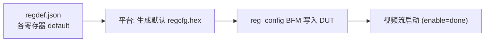
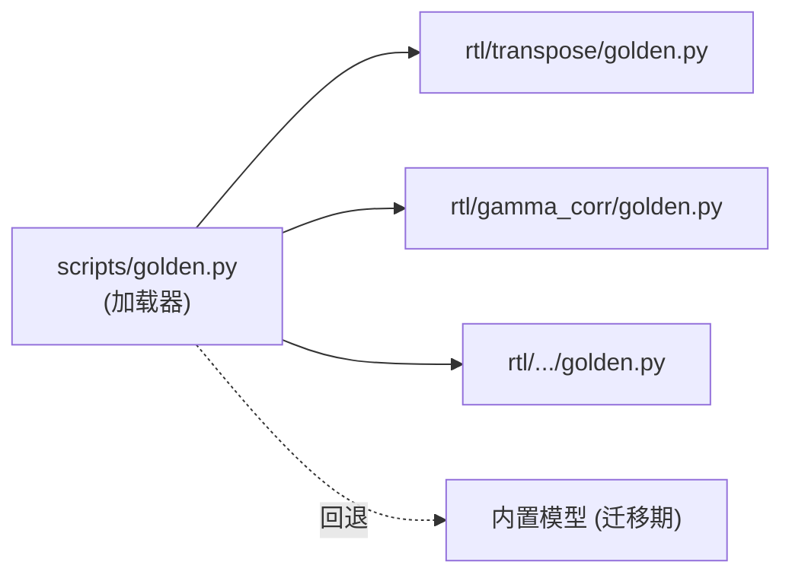
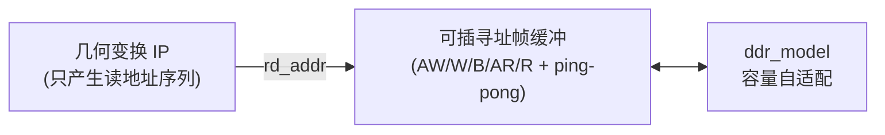
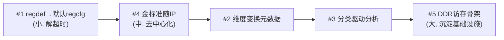

# VIP Sim 平台改进建议

> 来源：在开发 **行列转置 IP（transpose）** 过程中暴露的工具链摩擦点。
> transpose 属于"需要整帧缓冲 + 输入输出维度变换"的 IP，与平台现有"逐点增强类"
> IP 的假设不一致，连续踩坑。以下每条都附带本次的真实证据、根因与可落地的改法。
>
> 适用对象：平台维护者。改动均向后兼容现有 IP（除非特别标注）。

---

## 优先级总览

| 编号 | 改进点 | 痛点等级 | 改动量 | 兼容性 | 状态 |
| -- | -------------------------------- | ---- | --- | ----- | ---- |
| #1 | 用 `regdef.default` 生成默认 regcfg（替代清空） | 高 | 小 | 完全兼容 | ✅ 已实现 |
| #4 | 金标准模型随 IP 走，自动发现（去中心化） | 高 | 中 | 完全兼容 | ✅ 已实现 |
| #2 | 引入"维度变换"元数据，正确注入分辨率 | 中 | 中 | 完全兼容 | ✅ 已实现 |
| #3 | IP 分类驱动分析路径（逐点/几何/帧间） | 中 | 中 | 完全兼容 | ✅ 已实现 |
| #5 | DDR 访存骨架：容量自适配 + 可插自定义寻址 | 中 | 大 | 新增基础设施 | ✅ 已实现 |

> 5 项均已落地于 `extension/template/`（向后兼容，现有 IP 零回归）。各节末尾「实现」
> 小结列出实际交付文件与验证方式；汇总见文末 [实现总览](#实现总览)。

---

## #1 空配置假设导致帧间类 IP 挂死 —— 用 regdef 默认值生成 regcfg

### 现状与证据
回归与首次运行把寄存器配置清空：

```bash
# scripts/run_regression.sh
reset_regcfg() { printf 'FFFFFFFFFF\n' > sim/testdata/regcfg.hex; }
```

逐点增强类 IP 复位即 enable，空配置能跑，所以一直没问题。但 transpose
**必须先知道分辨率**才能整帧缓冲+转置读出。空配置下 `IN_WIDTH=IN_HEIGHT=0`，
帧像素总数 `0`，写状态机的 `total-1` 下溢成 `0xFFFFFFFF`，永不结束 → **仿真超时**。

本次现象：回归冒烟跑到 transpose 直接 `ERROR: 仿真超时`。

### 根因
"空配置 = 安全初始态"这个隐含假设只对无状态/逐点 IP 成立。`regdef.json` 里
已经声明了每个寄存器的 `default`，但运行时**没有被用来生成 regcfg**，只当文档。

### 建议
把"清空 regcfg"改为"**按 regdef.json 的 default 生成 regcfg**"。这样寄存器默认值
真正成为 IP 的安全初始态，与 RTL 复位值一致（project_rules 已要求二者逐位一致）。



### 落地细节
- 新增脚本（建议）`scripts/gen_default_regcfg.py`：读 `rtl/<ip>/regdef.json`，
  取所有 `access=="RW"` 寄存器的 `default`，按 `{addr[7:0]}{data[31:0]}` 一行一条
  输出，末尾加 `FFFFFFFFFF` 哨兵。格式与 `reg_config.v` / `golden.read_writes` 一致。
- 修改 `run_regression.sh` 的 `reset_regcfg`：由"清空"改为调用上述脚本生成该 IP 的默认 regcfg。
- 控制台（GUI）首次加载某 IP 时，寄存器界面用 regdef 的 default 预填（多数已如此），
  并保证"未改动也能导出一份非空 regcfg"。

### 兼容性
逐点 IP 的 default 与其复位值一致，生成的 regcfg 等价于原"空配置"行为，无回归风险。

> **实现** ✅：新增 `scripts/gen_default_regcfg.py`（读 regdef 的 RW `default`，按
> `{addr[7:0]}{data[31:0]}` + 哨兵输出）；`run_regression.sh` 的 `reset_regcfg [ip]`
> 改为有 regdef 则生成默认值、否则回退空配置。验证：transpose→3 条 RW 默认值，
> gamma 跳过 RO `VERSION`，passthrough 无 regdef→仅哨兵。

---

## #2 分辨率注入缺少"维度变换"概念

### 现状与证据
Makefile 用同一组 `WIDTH/HEIGHT` 同时喂三处：

```make
gen_stimulus: ... -W $(WIDTH) -H $(HEIGHT)          # 输入图尺寸
TB_PARAMS = -Ptb_$(IP).C_WIDTH=$(WIDTH) -Ptb_$(IP).C_HEIGHT=$(HEIGHT)
verify:    ... -W $(WIDTH) -H $(HEIGHT)             # 金标准建模尺寸
```

对输入≠输出维度的 IP（转置/缩放/旋转），这套语义不成立。本次 transpose 的 tb
只能**手动交换** source/sink 的 W/H，还要保证 regcfg 的 `IN_WIDTH/IN_HEIGHT` 跟着对，
极易出错（输入 64×48 → 输出 48×64）。

### 根因
工具链假设"一个分辨率贯穿输入/输出/参考模型"，没有"输出维度 = f(输入维度)"的表达。

### 建议
让 IP 声明输出维度变换。最小侵入做法：在 `regdef.json` 增加可选元数据段，或新增
`rtl/<ip>/ip.json` manifest：

```json
{
  "dims": { "out_w": "in_h", "out_h": "in_w" }
}
```

平台据此：
- 给 `axis_video_sink` 注入输出维度，`axis_video_source` 注入输入维度；
- `verify` 的参考模型按输入维度建模、按输出维度比对；
- 缺省（未声明）= 恒等变换 `out_w=in_w, out_h=in_h`，现有 IP 不受影响。

### 兼容性
未声明 `dims` 的 IP 走恒等路径，完全兼容。

> **实现** ✅：新增 `scripts/ip_manifest.py`（读 `rtl/<ip>/ip.json`，提供
> `out_dims()`/`category()`，缺省恒等）。`verify.py` 按输入维度建模、按输出维度比对；
> `Makefile` 派生 `OUT_WIDTH/OUT_HEIGHT`，仅当 OUT≠IN 时给 sink 注入
> `C_OUT_WIDTH/C_OUT_HEIGHT`，`gen_output` 按输出维度还原。验证：合成 transpose
> 输入 4×3 正确转置 result 比对 PASS、未转置 FAIL（在 3×4 输出维度上判定）。

---

## #3 分析路径只服务逐点类 IP

### 现状与证据
`make analyze` / 控制台分析按钮（图像对比 / 差异 / 锐度 / 白平衡 / 直方图 / PSNR）
默认输入输出同尺寸、同语义。几何变换类 IP 一点就出乱图或无意义指标——transpose
的输入 64×48 与输出 48×64 做 diff/PSNR 毫无意义，**只有 verify 金标准是正确入口**，
但 UI 没区分，用户容易被误导。

文档其实已经给 IP 分了类（`docs/IP_SPEC_ddr_frame_buffer.md` 区分"是否需整帧缓冲"），
但工具链没用上这个分类。

### 建议
IP 声明类别（沿用 #2 的 manifest）：

```json
{ "category": "pointwise | geometric | interframe" }
```

平台据此切换：
- `pointwise`：现有分析全开。
- `geometric`：以 verify 为主入口；diff/PSNR/锐度等基于像素对齐的按钮灰掉或标注"不适用"。
- `interframe`：分析针对"帧间差异/时域"维度，而非单帧对比。

### 兼容性
默认 `pointwise`，现有 IP 行为不变。

> **实现** ✅：`analyze.py` 新增 `--category`，`geometric/interframe` 跳过 PSNR/差异图
> 等逐像素对齐指标（标注"不适用 — 请用 verify 金标准"），不再因尺寸不一致崩溃；
> `Makefile analyze` 传 `--category $(CATEGORY)`。验证：不同尺寸图在 geometric 下不崩溃、
> `psnr=null`；pointwise 同尺寸仍出 PSNR、不同尺寸仍报错（回归保留）。

---

## #4 金标准模型中心化注册 —— 改为随 IP 自动发现

### 现状与证据
每加一个 IP 都要改公共文件 `scripts/golden.py`：

```python
CONFIG = { 'gamma_corr': {...}, ... 'transpose': {...} }   # 加一行
MODELS = { 'gamma_corr': m_gamma, ... 'transpose': m_transpose }  # 加一行 + 函数
```

这违背平台"文件放对位置就自动发现"的一贯理念：RTL / regdef / tb 都是自动发现的，
**唯独金标准要改公共文件**，新 IP 不自包含，还易引发合并冲突。

### 建议
支持 `rtl/<ip>/golden.py`（或 `model.py`）随 IP 走，平台自动加载：

```python
# rtl/transpose/golden.py
CONFIG = {'frames': 1, 'tol': 0, 'frac': 0.0}
def model(frame, writes, frame_idx, state):
    ...
    return out_frame
```

`scripts/golden.py` 改为**加载器**：扫描 `rtl/*/golden.py`，动态导入，构建 `MODELS/CONFIG`；
找不到则回退到内置（保留现有 IP 模型，平滑迁移）。



### 落地细节
- `golden.py` 用 `importlib` 扫描并导入各 IP 的 `golden.py`，约定导出 `CONFIG` 与 `model`。
- 迁移期：内置 `MODELS/CONFIG` 作为回退，逐个把 IP 模型搬到各自目录后删除内置项。
- `verify.py` / `compare.py` 接口不变。

### 兼容性
回退机制保证迁移期现有 IP 不受影响。

> **实现** ✅：`golden.py` 新增 `_discover_ip_models()`，导入时扫描 `rtl/*/golden.py`
> 动态加载并覆盖内置 `MODELS/CONFIG`；内置模型保留为迁移期回退，单个模块出错只告警
> 不中断；各 IP 模块可 `import golden` 复用 `clamp8/neighbors/final_regs` 等辅助。
> 验证：合成 `rtl/<ip>/golden.py` 被发现并合入，内置模型同时可用，`verify` 仍 PASS。

---

## #5 DDR 访存骨架：容量自适配 + 可插自定义寻址

### 现状与证据
帧间 IP 的 tb 要**手接一大坨 AXI 线** + 实例化 `ddr_model`，且 `C_MEM_WORDS` 要自己
按帧大小手算。本次 transpose 双缓冲第一次写死 `C_MEM_WORDS=8192`（只够 64×48 双槽），
换 800×600 直接**溢出，96.59% 失配**（超界地址读回 0）。

现有 `sim/common/axi_frame_buffer.v` 只做**线性 ping-pong**（`rptr++`），不支持转置这类
**自定义读地址**，所以 transpose 无法复用它，只能自接 `ddr_model`。

### 根因
帧缓冲基础设施只覆盖"恒等搬运"，容量也非自适配，几何/缩放类 IP 各自重接 AXI、各自踩容量坑。

### 建议
1. **容量自适配**：帧缓冲封装内部按 `帧像素 × 槽数` 自动定 `C_MEM_WORDS`，
   或 tb 模板统一 `localparam DDR_WORDS = SLOTS * IN_W * IN_H;`（本次 tb 已临时这么做，
   建议沉淀进公共模板）。
2. **可插寻址的帧缓冲**：在 `axi_frame_buffer` 基础上提供"读地址由外部生成"的变体，
   例如把 `rptr` 换成外部输入的 `rd_addr`，IP 只需提供地址序列（转置=列优先、
   缩放=步进、旋转=仿射），AXI 时序与双槽 ping-pong 仍由封装处理。



### 兼容性
作为**新增**基础设施，不动现有 `axi_frame_buffer` / `ddr_model`，老 IP 不受影响。

> **实现** ✅：新增 `sim/common/axi_frame_buffer_addr.v`（写帧流不变，读侧改为外部
> `rd_addr + rd_req` → `rd_data + rd_valid`，AXI 时序与双槽 ping-pong 仍由封装处理）；
> 新增自检 `sim/tests/tb_frame_buffer_addr.v`（写 2 帧后用转置读序校验，容量按
> `DDR_WORDS = 2 * W * H` 自适配），并接入 `run_regression.sh` 第 5 节。
> 验证：`PASS: 可插寻址帧缓冲自检通过, 转置读回 64 像素, 0 错误`。

---

## 建议实施顺序（已按此落地）



---

## 实现总览

5 项全部落地于 `extension/template/`，向后兼容（passthrough 端到端 sim/verify/analyze 均
PASS，现有 IP 零回归）。新增 / 修改文件：

| 文件 | 类型 | 对应 |
| --------------------------------- | --- | --- |
| `scripts/gen_default_regcfg.py` | 新增 | #1 regdef→默认 regcfg |
| `scripts/run_regression.sh` | 改 | #1 `reset_regcfg [ip]` 生成默认值；#5 接入帧缓冲自检 |
| `scripts/ip_manifest.py` | 新增 | #2/#3 `ip.json` 元数据（dims + category） |
| `scripts/verify.py` | 改 | #2 按输入维度建模、输出维度比对 |
| `Makefile` | 改 | #2 派生 `OUT_WIDTH/OUT_HEIGHT`+sink 注入；#3 传 `--category` |
| `scripts/analyze.py` | 改 | #3 `--category` 门控逐像素对齐指标 |
| `scripts/golden.py` | 改 | #4 `_discover_ip_models()` 扫描 `rtl/*/golden.py` |
| `sim/common/axi_frame_buffer_addr.v` | 新增 | #5 可插读地址帧缓冲 |
| `sim/tests/tb_frame_buffer_addr.v` | 新增 | #5 转置读自检 + 容量自适配 |
| `.trae/rules/project_rules.md` | 改 | 文档化 ip.json / golden 随 IP / 可插寻址帧缓冲 |

新增的「随 IP 走」约定文件（IP 作者按需提供，缺省回退）：
`rtl/<ip>/ip.json`（#2/#3）、`rtl/<ip>/golden.py`（#4）。
