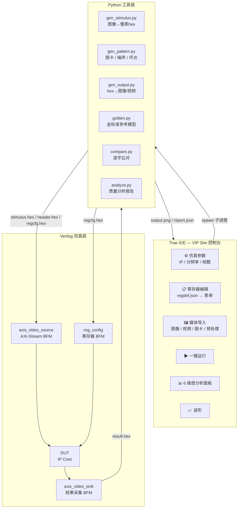
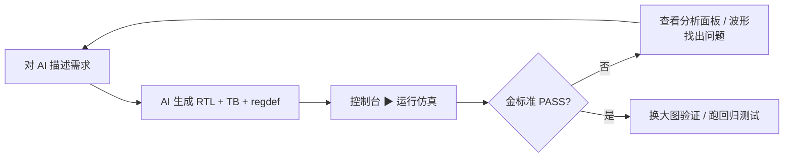

# VIP 仿真验证平台 用户使用说明书

| 属性   | 值                      |
| ---- | ---------------------- |
| 版本   | 1.1.0                  |
| 日期   | 2026-06-14             |
| 适用系统 | awesom 视频处理 IP        |
| 目标用户 | FPGA 验证工程师 / 课题学生 / IP 开发者 |

---

## 一、产品简介

VIP 仿真验证平台是一套**端到端视频 IP 仿真环境**，以 Trae / VS Code 扩展形式交付，提供图形化控制台与命令行双入口。核心能力：

- **图像/视频 → 仿真激励**：自动将真实图像转换为 Verilog `$readmemh` 可读的 hex 激励
- **一键仿真**：iverilog 编译 + 运行 + 结果采集全自动
- **结果还原**：仿真输出 hex 自动还原为图像/视频，直观查看效果
- **金标准比对**：Python 参考模型按位复现 RTL 定点运算，自动判定 PASS/FAIL
- **多维度质量分析**：锐度、白平衡、PSNR、直方图、Gamma 曲线，弹出独立面板

**一句话总结**：给一张图进去，拿到一张图出来，中间经过你的 IP，最后告诉你处理得好不好。

---

## 二、安装与环境配置

### 2.1 安装扩展

拿到 `vip-sim-0.9.0.vsix` 后，在终端执行：

```bash
code --install-extension vip-sim-0.9.0.vsix
```

安装完成后**重新加载 Trae / VS Code 窗口**（`Cmd+Shift+P` → `Developer: Reload Window`）。

### 2.2 前提条件

| 组件        | 安装方式                                                       | 必选/可选 |
| --------- | ------------------------------------------------------------ | ----- |
| iverilog   | `brew install icarus-verilog` (macOS) 或 `sudo apt install iverilog` (Linux) | **必选** |
| python3    | macOS 自带，或 `brew install python@3.10`                      | **必选** |
| VaporView  | VS Code 扩展市场搜索 `lramseyer.vaporview` 安装                   | 可选（IDE 内看波形） |
| GTKWave    | `brew install gtkwave`                                       | 可选（外部看波形） |

### 2.3 验证环境

打开终端，运行环境自检脚本：

```bash
echo "=== 环境自检 ==="
echo -n "Python: "; python3 --version
echo -n "OpenCV: "; python3 -c "import cv2; print(cv2.__version__)" 2>/dev/null || echo "未安装"
echo -n "NumPy:  "; python3 -c "import numpy; print(numpy.__version__)" 2>/dev/null || echo "未安装"
echo -n "Pillow: "; python3 -c "import PIL; print(PIL.__version__)" 2>/dev/null || echo "未安装"
echo -n "iverilog: "; iverilog -V 2>/dev/null | head -1 || echo "未安装"
echo "=== 自检完成 ==="
```

预期输出：

```
Python: Python 3.11.5
OpenCV: 4.9.0
NumPy:  1.26.4
Pillow: 10.2.0
iverilog: Icarus Verilog version 12.0 (stable)
```

> **注意**：Python 依赖包（opencv/numpy/pillow）无需手动安装。扩展在创建项目时会自动创建 `.venv` 并安装全部依赖。

---

## 三、系统架构



### 3.1 数据桥接

Python 与 Verilog 之间通过 **hex 文本文件** 桥接：

| 文件            | 方向           | 内容                       |
| ------------- | ------------ | ------------------------ |
| stimulus.hex  | Python → 仿真  | 32bit hex 像素数据            |
| header.hex    | Python → 仿真  | 分辨率、格式、帧数元数据             |
| regcfg.hex    | Python → 仿真  | 寄存器地址与写入值序列             |
| result.hex    | 仿真 → Python | 32bit hex 输出像素数据          |
| expected.hex  | Python → 仿真  | 金标准期望输出（用于比对）            |
| `*_report.json` | Python → 控制台 | 质量分析报告（各面板的数据源）          |

### 3.2 支持的像素格式

| 格式 ID | 名称     | 每像素位宽  | tdata 对应 Verilog 排列               |
| ----- | ------ | ------ | --------------------------------- |
| 3     | RGB888 | 24 bit | `{8'd0, R[7:0], G[7:0], B[7:0]}` |

> 目前主要支持 RGB888。RAW8/10/12、YUV422/444 格式在 Python 工具链中已定义，但 Verilog BFM 侧以 RGB888 为主力格式。

---

## 四、Trae 扩展使用（推荐入口）

### 4.1 新建仿真项目

`Cmd+Shift+P` → `VIP Sim: 新建仿真项目` → 选择存放位置 → 输入项目名（如 `my_gamma_test`）。

扩展自动完成：
1. 复制完整仿真环境到新目录（Python 脚本 / Verilog BFM / Makefile / 示例 DUT）
2. 创建项目内 Python 虚拟环境 `.venv`，安装 opencv/numpy/pillow
3. 新窗口打开项目

### 4.2 打开仿真控制台

`Cmd+Shift+P` → `VIP Sim: 打开仿真控制台`

控制台布局：

```
┌─ 🎬 VIP 仿真控制台 ────────────────────────┐
│  awesom 视频处理IP · 端到端仿真验证平台        │
└──────────────────────────────────────────────┘

┌─ ⚙ 仿真参数 ────────────────────────────────┐
│  目标 IP: [passthrough ▼]  宽: 64  高: 48  帧数: 1 │
└──────────────────────────────────────────────┘

┌─ 📋 寄存器配置 ──仿真开始时写入 DUT───────────┐
│  地址    名称   访问   值          说明         │
│  0x04    CTRL  RW   [0x00000001]  bit0=使能...  │
│  ...                                       │
│  可写(RW)寄存器可编辑 · 只读(RO)仅展示复位值       │
│  [↺ 恢复缺省值]                              │
└──────────────────────────────────────────────┘

┌─ 🖼 媒体输入/输出 ────────────────────────────┐
│  ┌─ 输入 ─┐          ┌─ 仿真输出 ─┐           │
│  │ [缩略图] │          │ [缩略图]    │           │
│  │ 📂导入图像│          │ 💾导出图像   │           │
│  │ 🎬导入视频│          └────────────┘           │
│  │ 🎨生成图卡│                                  │
│  │ ⚔预处理  │                                  │
│  └──────────┘                                  │
└──────────────────────────────────────────────┘

  [▶ 运行仿真]                             [📈 查看波形]

  结果分析: [📷图像对比] [🔥差异热力图] [🔍锐度] [🌡白平衡] [📊直方图] [📡PSNR]
```

### 4.3 全部命令速查

| 命令                                       | 说明                        |
| ---------------------------------------- | ------------------------- |
| VIP Sim: 新建仿真项目                          | 复制完整工具包到新目录并创建 venv       |
| VIP Sim: 打开仿真控制台                         | 主 GUI（运行 / 分析 / 寄存器 / 图卡） |
| VIP Sim: 查看波形                            | IDE 内打开本次仿真 VCD           |
| VIP Sim: 环境自检                            | 检查 iverilog / venv / 环境文件版本 |
| VIP Sim: 同步环境文件到当前项目                     | 扩展升级后更新老项目的 BFM / 脚本 / 规则 |

### 4.4 GUI 操作要点

**导入图像**：弹出文件对话框选取 PNG/BMP/JPG，自动复制到 `sim/testdata/` 并设为激励源。

**生成图卡**：弹出 9 种内置测试图卡：
- 灰阶渐变（测试 Gamma / 对比度）
- 彩条（测试色彩空间转换）
- 低对比度图（测试对比度增强）
- 棋盘格（测试边界对齐）
- 灰卡·6500K / 3000K / 8500K（测试白平衡）
- 噪声注入 + 坏点注入（基于当前图）

**预处理**：在仿真前对输入图像施加算子：高斯噪声 / 坏点注入 / 高斯模糊 / 组合 / 自定义（AI 生成）

**寄存器编辑**：控制台自动读取 `rtl/<IP>/regdef.json`，RW 寄存器显示为可编辑输入框，RO 寄存器灰显缺省值。点击运行时会按当前编辑值生成 `regcfg.hex` 写入仿真。

**运行仿真**：一键串行执行 `gen_stimulus → gen_header → iverilog 编译 → vvp 运行 → gen_output → analyze`。

**分析面板**：6 个按钮各对应一个独立 Webview 面板，可同时打开多面板对比查看。

---

## 五、典型使用场景

### 场景 1：单帧图像仿真（最常用）

**适用 IP**：色彩空间转换、Gamma 校正、坏点校正、降噪、锐化、对比度增强

**操作步骤**：

1. 控制台中导入一张测试图像（建议 640×480，日常调试用小分辨率）
2. 选择目标 IP，设好分辨率
3. 编辑寄存器值（如 Gamma 系数 `0x04=0x00000003` 表示 bypass 模式）
4. 点击 **▶ 运行仿真**
5. 仿真完成后查看输出缩略图 → 点击分析按钮看各项指标

**控制台输出示例**（金标准 PASS 时）：

```
📋 金标准  PASS  逐位精确，0 个像素失配
📊 质量分析  PSNR 42.3 dB · 640×480
```

**命令行等价操作**：

```bash
make all IP=gamma_corr WIDTH=640 HEIGHT=480 INPUT_IMG=sim/testdata/input.png
```

---

### 场景 2：从零开发 IP（Vibe Coding 流程）

**适用场景**：用户拿到项目后，手头没有 IP 代码，通过 AI 生成。

**步骤**：

1. 阅读 `docs/IP开发课题说明书.md` 中对应课题的规格
2. 对 AI 说："实现课题二 Gamma 校正 IP，按项目规则放置文件"
3. AI 按 `.trae/rules/project_rules.md` 自动生成：
   - `rtl/gamma_corr/gamma_corr.v` — RTL
   - `rtl/gamma_corr/regdef.json` — 寄存器描述
   - `sim/tests/tb_gamma_corr.v` — Testbench
4. 刷新控制台，IP 下拉框自动出现 `gamma_corr`
5. 导入图像 → 运行仿真 → 分析结果 → 迭代修改

**开发迭代循环**：



---

### 场景 3：金标准比对验证

**适用 IP**：所有 7 个 IP

**原理**：每个 IP 有一个 Python 参考模型（`scripts/golden.py`），用与 RTL 完全一致的整数/定点算法复现处理结果，逐字比对仿真输出。

**运行方式**：
- 控制台点击 ▶ 运行仿真时自动比对，结果显示在界面上
- 命令行：`make verify IP=gamma_corr WIDTH=640 HEIGHT=480`

**结果解读**：

| 显示                      | 含义                                |
| ----------------------- | --------------------------------- |
| 金标准 PASS               | 逐位精确，0 像素失配。算法正确                  |
| 金标准 FAIL               | 存在像素失配，显示失配数量和首个失配坐标。需要检查 RTL     |
| 无参考模型                   | 该 IP 暂未注册金标准模型，仅做图像质量分析            |
| 视频模式 · 逐帧不做按位比对         | 视频模式下不做逐字比对，用时序分析评估                   |

---

### 场景 4：视频多帧仿真

**适用 IP**：降噪（时域）、自动白平衡（帧间统计）、对比度增强（帧间统计）

**操作步骤**：

1. 控制台中点击 **🎬 导入视频**
2. 选择 MP4 文件，扩展自动探测帧数
3. 设置仿真帧数（建议 2~30，iverilog 速度有限）
4. 点击 ▶ 运行仿真
5. 仿帧完成后：拖动滑块逐帧预览 → 点击"时序分析"查看指标随帧变化

> **重要**：统计类 IP（AWB、对比度增强）必须多帧仿真。增益在帧 N 统计、帧 N+1 生效，单帧仿真输出等于输入。

**命令行**：

```bash
make video IP=denoise INPUT_VIDEO=sim/testdata/test.mp4 FRAMES=30
```

---

### 场景 5：回归测试（CI 批量验证）

**用途**：修改公共模块后，快速验证所有 IP 未被破坏。

```bash
make regression
```

该命令对每个已注册 IP 执行：单帧直通 → 金标准比对 → 随机反压测试，汇总 PASS/FAIL。

---

### 场景 6：调试波形

**步骤**：
1. 在控制台点击 **📈 查看波形**（自动生成 VCD 并打开）
2. 或命令行：`make sim WAVE=1 IP=gamma_corr`
3. 在波形查看器中检查：
   - `aresetn` → `s_axis_tvalid` 的复位释放时序
   - `tuser/tlast` 的 SOF/EOL 对齐（帧首/行尾是否正确）
   - `tready` 握手期间 tdata 有无毛刺
   - 流水线延迟：输入像素到输出像素的时钟周期数

---

### 场景 7：验证缺陷注入与鲁棒性

**操作**：控制台 **⚔ 预处理** → 选择注入项 → 运行仿真

| 注入项           | 测试目标                   |
| ------------- | ---------------------- |
| 高斯噪声 σ=15    | 验证降噪 IP 的噪声抑制能力        |
| 坏点注入 200/帧    | 验证坏点校正 IP 是否能检测并修复     |
| 高斯模糊 5×5     | 验证锐化 IP 是否能恢复清晰度       |
| 噪声+坏点（组合）    | 验证链式处理（降噪→坏点校正）的级联效果  |

---

## 六、图像质量分析详解

每次仿真完成后自动运行 5 项分析。控制台点击对应按钮弹出独立面板。

### 6.1 图像对比

左右并排显示输入图和输出图，确认视觉效果。适合快速验证"有没有处理"。

### 6.2 差异热力图

`|输出 - 输入|` 的伪彩色渲染。红色区域 = 变化大的区域，蓝色 = 无变化区域。一眼定位 IP 的作用范围。

### 6.3 锐度分析

| 指标               | 算法                     | 解读                        |
| ---------------- | ---------------------- | ------------------------- |
| Laplacian 方差     | `cv2.Laplacian().var()` | 整体锐度。值越高越清晰              |
| Tenengrad 值      | Sobel 梯度平方和            | 经典对焦评价函数。边缘越强值越高         |
| 等级               | 自动判定                   | 模糊 / 一般 / 良好 / 优秀 / 极佳 |

**典型用例**：

- 锐化 IP 开发：输入模糊图卡，期望输出 Laplacian 方差显著提升
- 降噪 IP 开发：输入噪声图，期望输出不损失过多锐度（Laplacian 方差下降不明显）

### 6.4 白平衡分析

| 指标   | 算法               | 解读                  |
| ---- | ---------------- | ------------------- |
| R/G/B 增益 | 灰度世界假设           | 理想值为 `1.0 / 1.0 / 1.0` |
| 色温倾向 | R/B 比率估算         | 偏暖(黄) / 中性 / 偏冷(蓝)   |

**典型用例**：AWB IP 开发 — 输入灰卡·3000K（偏暖），期望输出增益接近 1.0 / 1.0 / 1.0，色温倾向变为"中性"。

### 6.5 直方图

| 指标       | 说明              |
| -------- | --------------- |
| R/G/B 均值 | 三通道平均亮度         |
| 亮度变化     | 输入均值 → 输出均值的偏移 |
| 分位数统计    | P5/P50/P95 百分位  |

**典型用例**：

- Gamma 校正：输出均值应提升，暗部抬升
- 对比度增强：直方图分布应更均匀

### 6.6 PSNR

峰值信噪比，衡量输出与输入的差异程度。

| PSNR 范围   | 等级   | 含义                   |
| --------- | ---- | -------------------- |
| > 40 dB   | 优秀   | 差异极小，肉眼不可见           |
| 30–40 dB  | 良好   | 轻微差异                  |
| 20–30 dB  | 一般   | 明显差异（IP 正常工作，处理强度较大） |
| < 20 dB   | 差    | 差异很大（可能是算法或参数问题）     |

> **注意**：PSNR 高不一定好，低不一定差。锐化 IP 的 PSNR 天然偏低（主动改变了像素值）。PSNR 应结合其他指标综合判断。

### 6.7 Gamma 分析

实测 Gamma 曲线 vs 目标 Gamma 曲线。对 16 级灰度阶梯采样，最小二乘拟合出等效 Gamma 值。

**典型用例**：Gamma 校正 IP（目标 2.2，偏差 < 0.05 为优秀）、色彩空间转换 IP（目标 1.0 直通）。

---

## 七、命令行参考

扩展内部驱动命令行，但也可直接在终端使用。

### 7.1 Makefile 目标

| 目标               | 说明                              |
| ---------------- | ------------------------------- |
| `make all`       | 一键：激励生成 → 仿真 → 图像还原 → 金标准 → 质量分析 |
| `make sim`       | 仅运行仿真                           |
| `make verify`    | 金标准比对                           |
| `make regression` | 全 IP 回归测试                       |
| `make video`     | 视频模式全流程                         |
| `make sim WAVE=1` | 仿真 + 输出 VCD 波形                  |
| `make clean`     | 清理输出文件                          |

**Makefile 变量**（`make KEY=VALUE` 传入）：

| 变量           | 默认值        | 说明          |
| ------------ | ---------- | ----------- |
| IP           | passthrough | 目标 IP 名称    |
| WIDTH        | 64         | 图像宽度        |
| HEIGHT       | 48         | 图像高度        |
| FRAMES       | 1          | 帧数          |
| INPUT_IMG    | sim/testdata/test_input.png | 输入图像路径      |
| INPUT_VIDEO  | sim/testdata/test_input.mp4  | 输入视频路径      |

### 7.2 Python 脚本速查

| 脚本                    | 用途             | 示例                                |
| --------------------- | -------------- | --------------------------------- |
| gen_stimulus.py       | 图像 → hex 激励    | `-i input.png -o stimulus.hex -f RGB888` |
| gen_pattern.py        | 生成测试图卡         | `--pattern ramp -W 640 -H 480`     |
| gen_header.py         | 生成帧头信息         | `-w 640 -H 480 -f RGB888`          |
| gen_output.py         | hex → 图像/视频    | `-i result.hex -o output.png`      |
| gen_video_stimulus.py | 视频拆帧 → hex     | `-i input.mp4 --max-frames 30`     |
| analyze.py            | 质量分析 + 输出报告    | `--input in.png --output out.png --all` |
| verify.py             | 金标准比对编排        | `--ip gamma_corr -W 640 -H 480`    |
| preprocess.py         | 噪声/坏点/模糊注入    | `-i in.png -o out.png --noise 15`  |
| dump_frames.py        | 多帧 hex 拆帧为 PNG | `-i stimulus.hex -d dir/ --frames 30` |

---

## 八、项目目录结构

新建项目后的完整结构：

```
my_vip_project/
├── CLAUDE.md                    ← Vibe Coding 行为准则（先想再写、简单优先…）
├── docs/
│   └── IP开发课题说明书.md          ← 7 个 IP 课题的功能需求与算法规格
├── .trae/
│   └── rules/
│       └── project_rules.md       ← AI 代码生成规则（TB 骨架、接口约定、regdef 格式）
├── rtl/
│   ├── passthrough/               ← 示例 DUT（直通，可参考）
│   │   ├── passthrough.v
│   │   └── regdef.json
│   └── <你的 IP>/                 ← 你的 IP 代码放这里
│       ├── <ip_name>.v
│       └── regdef.json             ← 必须提供，控制台据此渲染寄存器编辑界面
├── sim/
│   ├── common/                    ← 公共 BFM（请勿修改）
│   │   ├── axis_video_source.v    ← AXI-Stream 激励源
│   │   ├── axis_video_sink.v      ← AXI-Stream 结果采集
│   │   └── reg_config.v           ← 寄存器配置
│   ├── tests/
│   │   └── tb_<ip_name>.v         ← 你的 IP 的 Testbench
│   └── testdata/                  ← 仿真数据（图像/hex 文件放这里）
├── scripts/                       ← Python 工具链
│   ├── gen_stimulus.py
│   ├── gen_output.py
│   ├── analyze.py
│   ├── golden.py                  ← 金标准参考模型
│   └── ...
├── output/
│   ├── images/                    ← 输出图像
│   ├── reports/                   ← 分析报告 JSON
│   └── waves/                     ← .vcd 波形文件
├── Makefile
├── requirements.txt
├── .gitignore
└── README.md
```

---

## 九、常见问题

**Q: 新建项目后 IP 下拉框是空的**

A: 新项目只有一个 `passthrough` 示例 IP。用 AI 生成或手写 IP 代码后，确保 `rtl/<ip_name>/` 目录存在 `.v` 文件，刷新控制台即可。

---

**Q: 仿真运行后提示"尚无结果"**

A: 检查 VIP Sim 输出面板的日志。常见原因：iverilog 编译失败（语法错误）、`stimulus.hex` 未生成、DUT 像素数不匹配导致 sink 挂死。

---

**Q: 统计类 IP（AWB/对比度增强）单帧仿真无效果**

A: 这是正常现象。统计类 IP 的增益/参数在帧 N 统计、帧 N+1 才生效。必须在控制台设置 `帧数 ≥ 2`，分析工具默认取最后一帧的结果。

---

**Q: 4K 分辨率仿真很慢**

A: iverilog 为解释执行，一帧 4K 含 830 万像素，仿真可能耗时数十分钟。日常调试使用缩小分辨率（如 64×64 或 256×144），算法逻辑与全分辨率完全一致。仅在里程碑验证时跑 1~2 次全分辨率。

---

**Q: 如何增加新 IP 的金标准模型**

A: 编辑 `scripts/golden.py`：
1. 在 `MODELS` 字典添加 `'<ip>': m_<ip>`
2. 实现 `m_<ip>(pixels, regs, width, height)` → 返回期望像素列表
3. 在 `CONFIG` 字典注册比对参数（帧数、容差、容许失配比例）
4. 运行 `make verify IP=<ip>` 验证

---

**Q: 仿真日志出现 `ERROR: 仿真超时`**

A: DUT 未输出足够像素，sink 一直等待。检查：
- DUT 是否正确透传 `tuser/tlast`
- 流水线深度是否导致输出延迟（超时保护默认足够大，除非像素数严重不匹配）
- 统计类 IP 是否开启了 bypass 模式

---

**Q: PSNR 100 dB，但金标准 FAIL**

A: 金标准比对的是 RTL 定点运算结果与 Python 参考模型的一致性（逐位精确），PSNR 衡量的是输出与输入的差异。两者独立——PSNR 高只说明输出接近输入，不说明算法正确。

---

**Q: 图像输出颜色偏紫/偏绿**

A: 检查 RTL 中 `tdata` 的字节排列是否为 `{8'd0, R[7:0], G[7:0], B[7:0]}`。常见错误是将 RGB 顺序写反或位宽截断错误。

---

**文档版本**：V1.1.0  
**最后更新**：2026-06-14
