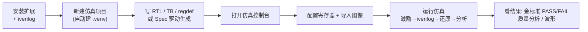

# VIP Sim 交付物 / Release

面向客户的交付内容，按版本归档。每个 `vX.Y.Z/` 子目录是一份完整可交付的版本。

> **当前版本：v1.0.0** ｜ 安装产物 + 用户手册见 [`v1.0.0/`](v1.0.0/)。

---

## 一、交付清单

| 交付物 | 文件 | 作用 |
| --- | --- | --- |
| **扩展安装包** | `v1.0.0/vip-sim-1.0.0.vsix` | Trae / VS Code 扩展，内置完整仿真工具包（Python 工具链 + AXI-Stream BFM + Makefile + 示例 IP），是产品本体 |
| **用户说明书** | `v1.0.0/VIP仿真平台用户说明书.pdf` | 安装、控制台操作、7 个典型场景、6 项分析详解、命令行参考、FAQ |
| **开发课题说明书** | `v1.0.0/awesom_VIP开发课题说明书.pdf` | 7 个视频 IP 开发课题（色彩空间/Gamma/白平衡/坏点/降噪/锐化/对比度）的规范与验收 |
| **发布说明** | `v1.0.0/RELEASE_NOTES.md` | 本版变更清单 |
| **本说明** | `release/README.md` | 交付清单、依赖、安装、使用流程、版本历史 |

> 扩展是「薄壳」：安装包内已打包全部仿真脚本与 BFM，**用户无需单独获取工具链源码**。
> 新建项目时扩展会把工具包复制进用户项目目录并自建 Python 环境。

---

## 二、依赖（运行环境）

| 组件 | 必选/可选 | 说明 / 安装 |
| --- | --- | --- |
| Trae 或 VS Code | **必选** | 承载扩展的 IDE（标准 VS Code 扩展 API） |
| iverilog (Icarus Verilog) | **必选** | 仿真器。macOS `brew install icarus-verilog`；Linux `sudo apt install iverilog` |
| Python 3.10+ | **必选** | 跑工具链。macOS 自带或 `brew install python@3.10` |
| opencv-python / numpy / pillow | 自动 | **无需手动装**：新建项目时扩展自动建 `.venv` 并安装 |
| VaporView 扩展 | 可选 | IDE 内查看波形（VCD）。扩展市场搜 `lramseyer.vaporview` |

> Python 图像依赖由扩展在 `.venv` 内自动准备，客户机只需保证 **iverilog + python3** 可用。

---

## 三、安装

```bash
# 1) 安装系统依赖（仅首次）
brew install icarus-verilog            # macOS（Linux 用 apt）

# 2) 安装扩展
code --install-extension v1.0.0/vip-sim-1.0.0.vsix
#   或在 Trae/VS Code: 扩展面板 → ··· → Install from VSIX → 选择该 .vsix
```

安装后 **重新加载窗口**（`Cmd+Shift+P` → `Developer: Reload Window`）。
首次新建项目时扩展会自动创建 `.venv` 并安装 Python 依赖。

---

## 四、使用流程



1. **新建仿真项目**（`VIP Sim: 新建仿真项目`）：自动复制工具包并建 `.venv`。
2. **开发 IP**（两种方式）：
   - **Spec 驱动**（推荐）：写 `.ip_spec.yaml` → `python scripts/gen_ip_spec.py --spec xxx.yaml` → RTL + 金标准 + TB + regdef 同时生成
   - **传统参照**：按 `docs/IP开发课题说明书.md` 手动编写，金标准手动补充到 `golden.py`
3. **打开仿真控制台**（`VIP Sim: 打开仿真控制台`）：选 IP、设分辨率/帧数、编辑寄存器、导入图像。
4. **运行仿真**：一键完成激励→仿真→还原→分析；运行前自动生成 regcfg.hex 并做寄存器读写自检。
5. **看结果**：金标准 PASS/FAIL、图像对比/差异/锐度/白平衡/直方图/PSNR、波形。

---

## 五、版本历史

| 版本 | 日期 | 安装包 | 备注 |
| --- | --- | --- | --- |
| **1.0.0** | 2026-06-24 | [`v1.0.0/vip-sim-1.0.0.vsix`](v1.0.0/) | **当前发布**。Spec 驱动代码生成 + 级联组合 IP + DPC 仿真修复 + 全文档更新。详见 [RELEASE_NOTES](v1.0.0/RELEASE_NOTES.md) |
| 0.9.5 | 2026-06-21 | [`v0.9.5/vip-sim-0.9.5.vsix`](v0.9.5/) | 寄存器读写自检 + 平台改进 #1–#5 |
| 0.9.4 | 2026-06-19 | [`v0.9.4/vip-sim-0.9.4.vsix`](v0.9.4/) | 历史归档 |
| 0.9.3 | 2026-06-19 | [`v0.9.3/vip-sim-0.9.3.vsix`](v0.9.3/) | 历史归档 |
| 0.9.2 | 2026-06-15 | [`v0.9.2/vip-sim-0.9.2.vsix`](v0.9.2/) | 历史归档 |
